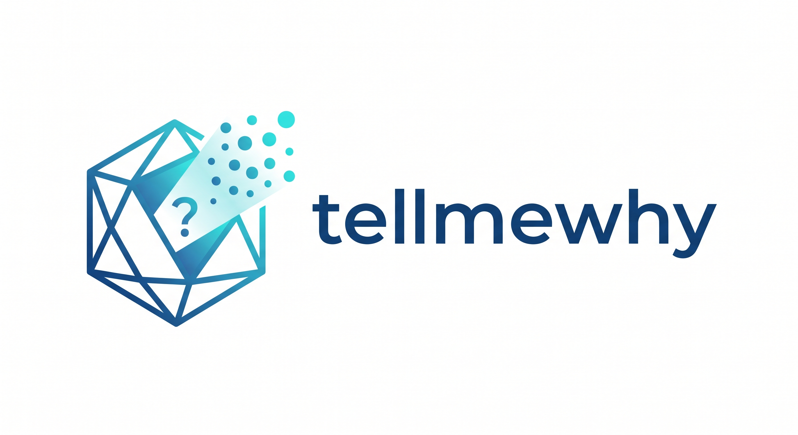
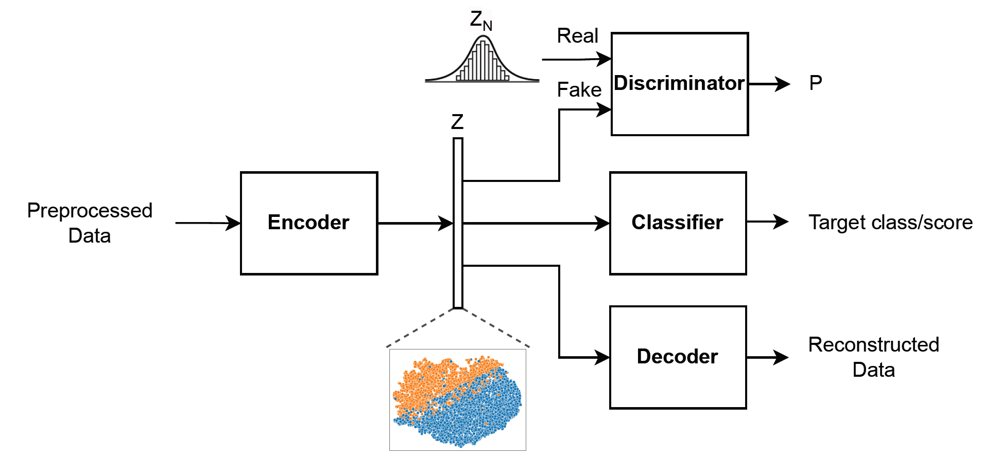
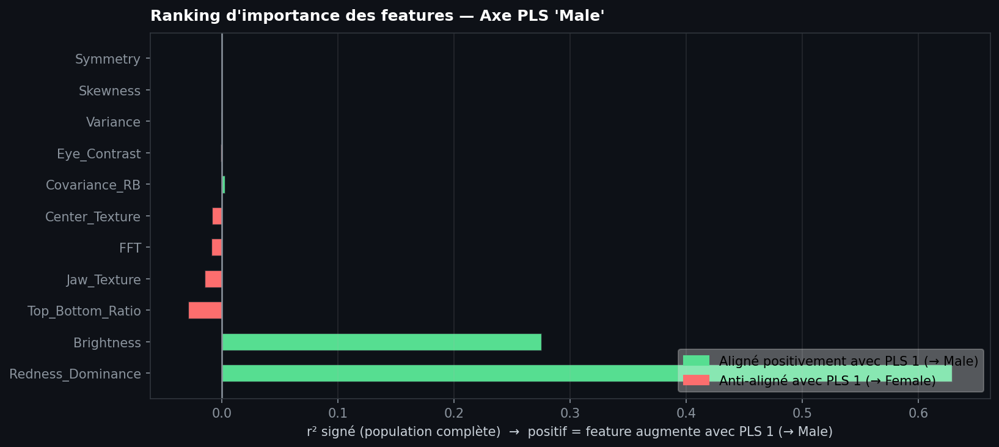
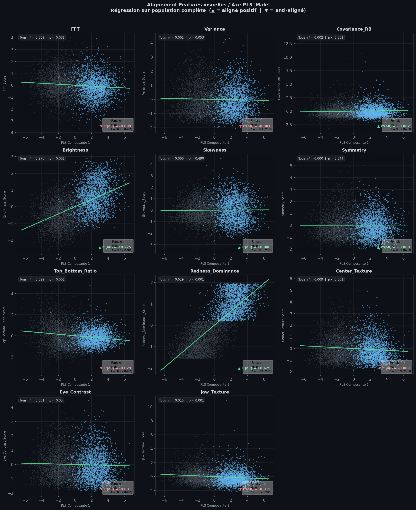

# Tell Me Why

<p align="center">
  
</p>

**Tell Me Why** is a Python library for training **explainable xAAEnet** models on **binary image classification** tasks, then relating model representations to simple, interpretable **pixel-level feature scores**.

It is built on [fastai](https://docs.fast.ai/) and [PyTorch](https://pytorch.org/). Library code is exported from `nbs/*.ipynb` with [nbdev](https://nbdev.fast.ai/).

## Scope

**Binary image classifiers only** for now (two classes, image inputs). Multi-class classification, regression, and non-image modalities are not supported yet.

## How it works

### xAAEnet model

An encoder maps each image to a representation vector **z**. A decoder reconstructs the image; a discriminator regularizes **z**; a classifier predicts the binary label from **z**.

<p align="center">
  
</p>

Training runs in three phases: **adversarial** → **autoencoder** (denoising reconstruction) → **classifier** (`train_xaaenet`).

### From representations to pixel cues

After training, you compare the model’s **PLS decision axis** (derived from validation **z** and class labels) with hand-crafted scores from `compute_feature_score_table` (brightness, color, texture, etc.).

`run_pls_feature_figures` produces two views:

**1. Feature importance ranking** — which cues align most with the decision axis (start here).

<p align="center">
  
</p>

| Read the chart | |
|----------------|--|
| Long **green** bar (right) | Feature increases with PLS1 toward class A |
| Long **red** bar (left) | Feature decreases toward class A (aligned with class B) |
| Short bar | Weak linear link to the decision axis on this sample |

**2. Alignment panels** — one scatter per feature: PLS1 (horizontal) vs standardized score (vertical).

<p align="center">
  
</p>

| Read a panel | |
|--------------|--|
| **Diagonal** green line, classes separated | Strong co-variation — plausible pixel cue for the task |
| **Flat** green line, mixed cloud | Weak link — model probably not using this cue much |
| Grey / blue points | Class B / class A |

Use the **ranking** to shortlist features; use the **panels** to sanity-check the top ones. These are alignment statistics, not a proof of what the network implements internally.

More detail: [Classification interpretation](https://tell-me-why-xai.github.io/Tell-Me-Why/visualization.html) in the docs.

## Installation

```bash
git clone https://github.com/Tell-Me-Why-xAI/Tell-Me-Why.git
cd Tell-Me-Why
```

**Conda (recommended):**

```bash
conda env create -f environment.yml
conda activate tell-me-why
pip install -e ".[dev]"
```

**pip only** (Python 3.10–3.12):

```bash
python -m venv .venv
source .venv/bin/activate
pip install -e ".[dev]"
```

Images should be at least about **160×160** pixels (MS-SSIM reconstruction loss).

## Quick start

```python
from fastai.vision.all import *
from tell_me_why.model_aae import AAE
from tell_me_why.training import train_xaaenet

# dls: fastai DataLoaders (ImageBlock, CategoryBlock) for your binary task

model = AAE(input_size=160, input_channels=3, encoding_dims=128, classes=2)
learn = train_xaaenet(model, dls, epochs_adv=1, epochs_ae=1, epochs_classif=2)
```

Then extract validation **z**, build a feature table with `compute_feature_score_table`, and run `run_pls_feature_figures`. See the [end-to-end walkthrough](https://tell-me-why-xai.github.io/Tell-Me-Why/walkthrough.html).

## Documentation

- **Docs:** [https://tell-me-why-xai.github.io/Tell-Me-Why](https://tell-me-why-xai.github.io/Tell-Me-Why)
- **Figures** for the site and this README live in [`nbs/images/`](nbs/images/) (no duplicate `images/` at the repo root).

| Notebook | Topic |
|----------|--------|
| `01_model_aae.ipynb` | `AAE` architecture and losses |
| `02_feature_scores.ipynb` | Pixel feature scores |
| `03_user_encoder.ipynb` | Custom encoder + xAAEnet blocks |
| `04_training.ipynb` | `train_xaaenet` |
| `05_visualization.ipynb` | Interpretation figures |
| `06_walkthrough.ipynb` | End-to-end example (PETS) |

## Development

```bash
conda activate tell-me-why
nbdev-export
nbdev-test
nbdev-preview
```

This **README is maintained by hand** (not generated from `index.ipynb`). CI runs `touch README.md` before `nbdev-docs` so `nbdev-readme` does not overwrite it.

## License

MIT (see `pyproject.toml`).
